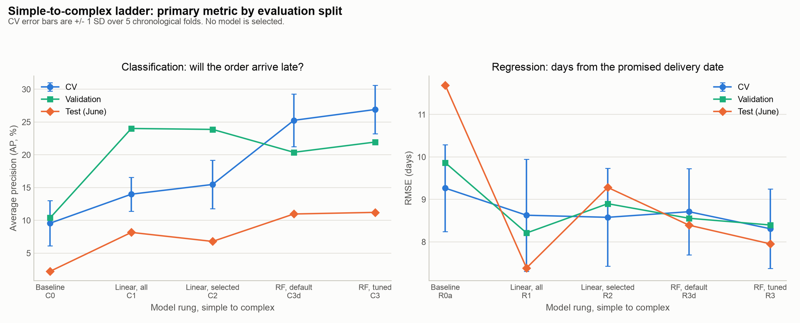
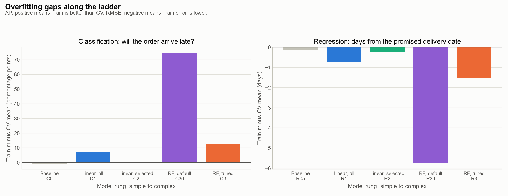
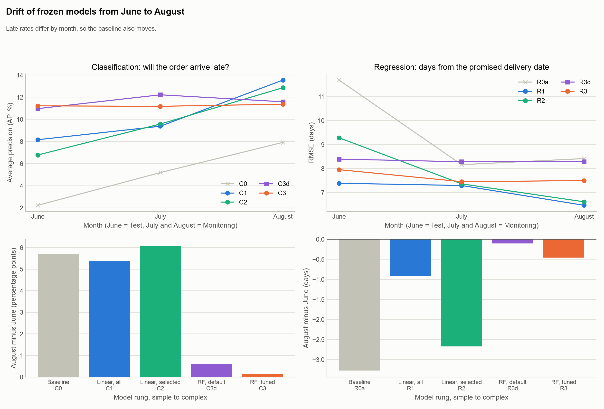
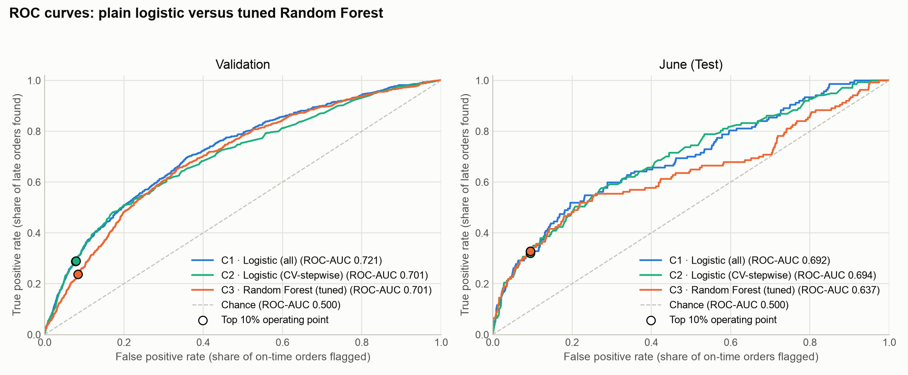
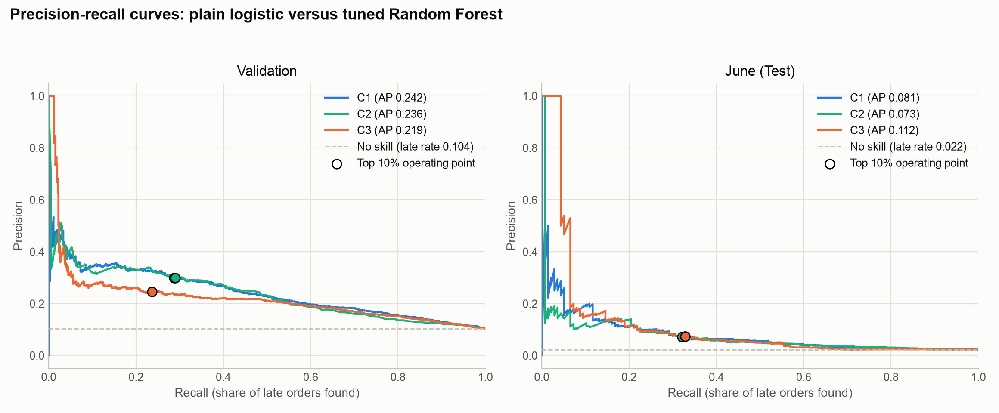
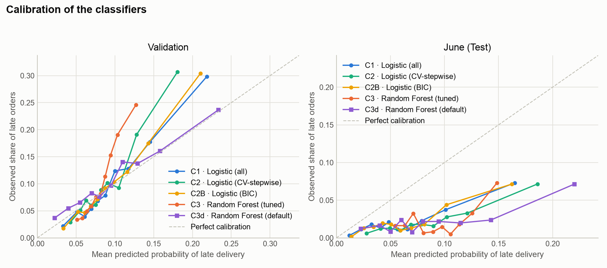
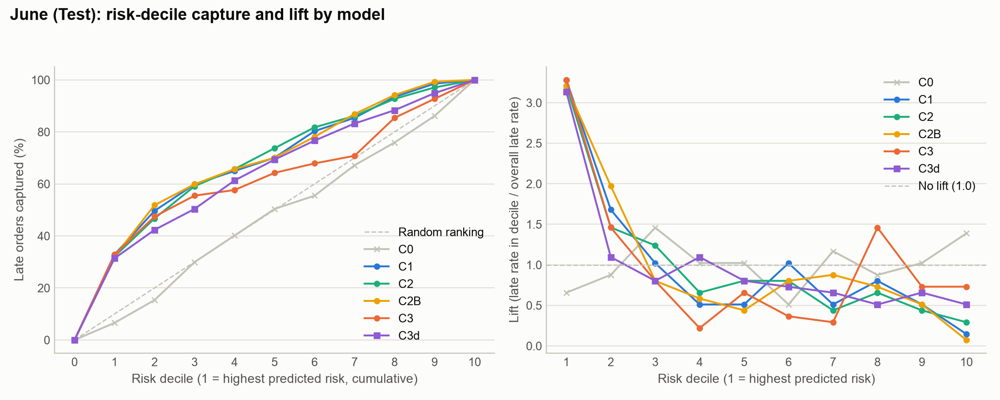
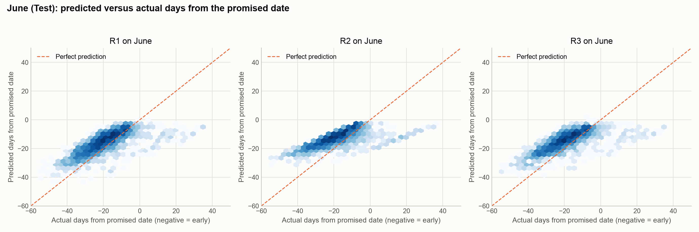
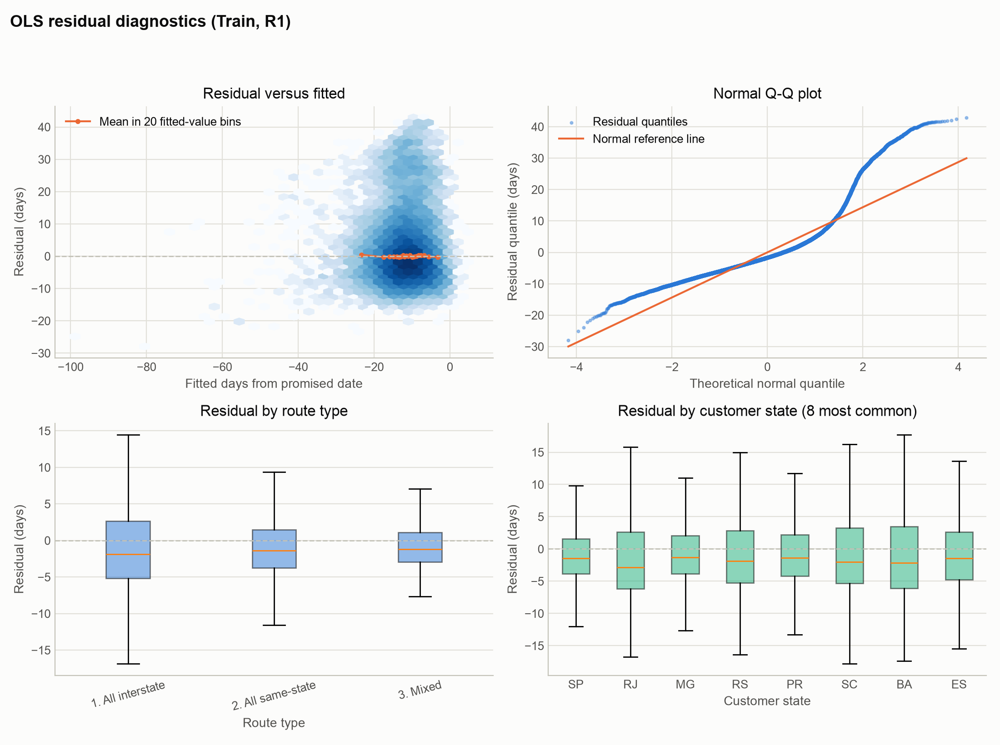

# Results summary: simple to complex

Generated by `python -m src.summary` from the exported tables and metadata only; nothing is refitted. Protocol: Train (in-sample), CV (5 chronological folds inside Train), Validation (30-day out-of-time holdout), Test (June) and Monitoring (July, August) scored by frozen models. No model is selected. Primary metrics: AP for classification, RMSE for regression.

## 1. The simple-to-complex ladder

**Classification: will the order arrive late?** (Average precision (AP, %))

| Rung | Model | CV mean +/- SD | Validation | Test (June) |
|---|---|---|---|---|
| Baseline | C0 | 9.57 +/- 3.43 | 10.38 | 2.23 |
| Linear, all | C1 | 13.99 +/- 2.59 | 24.01 | 8.16 |
| Linear, selected | C2 | 15.48 +/- 3.69 | 23.87 | 6.78 |
| RF, default | C3d | 25.26 +/- 4.00 | 20.38 | 10.97 |
| RF, tuned | C3 | 26.91 +/- 3.70 | 21.94 | 11.22 |

**Regression: days from the promised delivery date** (RMSE (days))

| Rung | Model | CV mean +/- SD | Validation | Test (June) |
|---|---|---|---|---|
| Baseline | R0a | 9.27 +/- 1.02 | 9.86 | 11.69 |
| Linear, all | R1 | 8.63 +/- 1.32 | 8.21 | 7.39 |
| Linear, selected | R2 | 8.58 +/- 1.15 | 8.90 | 9.28 |
| RF, default | R3d | 8.71 +/- 1.01 | 8.56 | 8.39 |
| RF, tuned | R3 | 8.31 +/- 0.93 | 8.40 | 7.95 |

## 2. Classification: will the order arrive late?

### 2.1 Row counts per split

| Split | Orders | Late orders | Late rate (%) | First approval | Last approval |
|---|---|---|---|---|---|
| Train | 45972 | 4061 | 8.83 | 2017-04-18 | 2018-02-01 |
| Validation | 6870 | 713 | 10.38 | 2018-03-19 | 2018-04-17 |
| History before 2 June (June refit) | 63592 | 6963 | 10.95 | 2017-04-18 | 2018-04-17 |

Frozen models score the Test and Monitoring months:

| Evaluation split | Orders scored |
|---|---|
| Test (June) | 6,164 |
| Monitoring (July) | 6,129 |
| Monitoring (August) | 6,606 |

### 2.2 Transforms kept (linear models), with CV evidence

Groups kept: log, cyclic, squared. Log columns: payment_value_sum, order_frieght_value_sum, order_product_weight_g_sum, order_product_volume_cm3_sum, approval_lag_hours, seller_dist_km_mean, freight_to_price_ratio, orders_approved_prev_7d. Squared columns: promised_lead_days, approval_lag_hours, payment_value_sum. Mixed route folded into All interstate: True.

| Design | cv_mean | cv_sd | change_vs_kept | Kept | Decision step |
|---|---|---|---|---|---|
| raw | 0.1294 | 0.022 | 0.0 | True | log, cyclic |
| raw + log | 0.138 | 0.0244 |  | False | log, cyclic |
| kept (raw) + log | 0.138 | 0.0244 | 0.0087 | True | log, cyclic |
| raw + cyclic | 0.1289 | 0.0234 |  | False | log, cyclic |
| kept (log) + cyclic | 0.1383 | 0.0261 | 0.0003 | True | log, cyclic |
| log+cyclic | 0.1383 | 0.0261 | 0.0 | True | squared (promised_lead_days, approval_lag_hours, payment_value_sum) |
| log+cyclic + squared | 0.1399 | 0.0259 |  | False | squared (promised_lead_days, approval_lag_hours, payment_value_sum) |
| kept (log+cyclic) + squared | 0.1399 | 0.0259 | 0.0016 | True | squared (promised_lead_days, approval_lag_hours, payment_value_sum) |

### 2.3 Stepwise path, chosen step and selected variables

The best CV step is 15 and the 1-SE rule chooses step 6, which gives C2 with 6 variable(s): customer_state, order_approved_day_of_month, order_seller_count, order_approved_day_of_week, promised_lead_days, route_type.

| step | added_unit | n_units | n_encoded_columns | CV mean | CV SE | Marker |
|---|---|---|---|---|---|---|
| 0 | (intercept only) | 0 | 0 | 0.0957 | 0.0153 |  |
| 1 | customer_state | 1 | 26 | 0.1303 | 0.0174 |  |
| 2 | order_approved_day_of_month | 2 | 27 | 0.135 | 0.0191 |  |
| 3 | order_seller_count | 3 | 28 | 0.1362 | 0.0192 |  |
| 4 | order_approved_day_of_week | 4 | 30 | 0.1368 | 0.0185 |  |
| 5 | promised_lead_days | 5 | 32 | 0.1372 | 0.0171 |  |
| 6 | route_type | 6 | 33 | 0.1548 | 0.0165 |  1-SE choice |
| 7 | order_product_weight_g_sum | 7 | 34 | 0.1563 | 0.0168 |  |
| 8 | approval_lag_hours | 8 | 36 | 0.1576 | 0.0167 |  |
| 9 | order_frieght_value_sum | 9 | 37 | 0.1578 | 0.0167 |  |
| 10 | order_item_count | 10 | 38 | 0.1581 | 0.0167 |  |
| 11 | is_weekend_approval | 11 | 39 | 0.1583 | 0.0166 |  |
| 12 | payment_combination | 12 | 43 | 0.1584 | 0.0166 |  |
| 13 | seller_state_count | 13 | 44 | 0.1584 | 0.0166 |  |
| 14 | is_black_friday_period | 14 | 45 | 0.1584 | 0.0166 |  |
| 15 | is_december_peak | 15 | 46 | 0.1584 | 0.0166 | best CV step |
| 16 | order_product_photos_mean | 16 | 47 | 0.1583 | 0.0166 |  |
| 17 | order_product_category_count | 17 | 48 | 0.1581 | 0.0166 |  |
| 18 | freight_to_price_ratio | 18 | 49 | 0.1575 | 0.0164 |  |
| 19 | order_product_volume_cm3_sum | 19 | 50 | 0.1572 | 0.0167 |  |
| 20 | payment_installments_max | 20 | 51 | 0.1564 | 0.0167 |  |
| 21 | seller_dist_km_mean | 21 | 52 | 0.1544 | 0.0166 |  |
| 22 | payment_value_sum | 22 | 54 | 0.1529 | 0.016 |  |
| 23 | order_approved_month | 23 | 56 | 0.1485 | 0.0163 |  |
| 24 | orders_approved_prev_7d | 24 | 57 | 0.1399 | 0.0116 |  |

### 2.4 Selection overlap: CV-stepwise, BIC, AIC and Lasso

| Method or model | Variables selected |
|---|---|
| C2 | 6 |
| C2B | 14 |
| AIC | 19 |
| Lasso | 24 |

| unit | cv_stepwise | cv_step_entered | bic | aic | lasso | n_methods |
|---|---|---|---|---|---|---|
| customer_state | yes | 1 | yes | yes | yes | 4 |
| order_seller_count | yes | 3 | yes | yes | yes | 4 |
| promised_lead_days | yes | 5 | yes | yes | yes | 4 |
| route_type | yes | 6 | yes | yes | yes | 4 |
| order_approved_day_of_month | yes | 2 |  | yes | yes | 3 |
| order_approved_day_of_week | yes | 4 |  | yes | yes | 3 |
| approval_lag_hours |  | 8 | yes | yes | yes | 3 |
| order_item_count |  | 10 | yes | yes | yes | 3 |
| is_black_friday_period |  | 14 | yes | yes | yes | 3 |
| is_december_peak |  | 15 | yes | yes | yes | 3 |
| order_product_photos_mean |  | 16 | yes | yes | yes | 3 |
| order_product_volume_cm3_sum |  | 19 | yes | yes | yes | 3 |
| seller_dist_km_mean |  | 21 | yes | yes | yes | 3 |
| payment_value_sum |  | 22 | yes | yes | yes | 3 |
| order_approved_month |  | 23 | yes | yes | yes | 3 |
| orders_approved_prev_7d |  | 24 | yes | yes | yes | 3 |
| is_weekend_approval |  | 11 |  | yes | yes | 2 |
| payment_combination |  | 12 |  | yes | yes | 2 |
| seller_state_count |  | 13 |  | yes | yes | 2 |
| order_product_weight_g_sum |  | 7 |  |  | yes | 1 |
| order_frieght_value_sum |  | 9 |  |  | yes | 1 |
| order_product_category_count |  | 17 |  |  | yes | 1 |
| freight_to_price_ratio |  | 18 |  |  | yes | 1 |
| payment_installments_max |  | 20 |  |  | yes | 1 |

### 2.5 Random Forest search and sensitivity

Stage A drew 60 random candidates from this space.

| parameter | values searched (Stage A) |
|---|---|
| max_depth | None, 6, 8, 10, 12, 16, 20, 30 |
| min_samples_leaf | 1, 2, 5, 10, 20, 50, 100, 200 |
| min_samples_split | 2, 5, 10, 20, 50 |
| max_features | log2, sqrt, 0.2, 0.3, 0.5, 0.7, 1.0 |
| max_samples | None, 0.5, 0.7, 0.9 |
| class_weight | None, balanced, balanced_subsample |
| criterion | gini, entropy |

| Item | Value |
|---|---|
| Stage A candidates | 60 |
| Stage A trees | 200 |
| Stage B candidates | 24 |
| Stage B trees | 300 or 500 |
| Best CV AP (mean +/- SD) | 0.2691 +/- 0.0331 |
| Stage A best CV AP | 0.2657 |
| Search time (Stage A + B, s) | 206 |
| Best parameters | {"min_samples_split": 50, "max_samples": 0.7, "criterion": "entropy", "class_weight": null, "max_depth": 8, "min_samples_leaf": 2, "max_features": "log2", "n_estimators": 500} |

Sensitivity of the Stage A search (spread = best minus worst score over the values of one hyperparameter; a larger spread means the score is more sensitive to that hyperparameter):

| Hyperparameter | Best value | Best candidate score | Worst value | Worst candidate score | Spread |
|---|---|---|---|---|---|
| min_samples_leaf | 1 | 0.2657 | 200 | 0.2612 | 0.0046 |
| max_depth | 8.0 | 0.2657 | 16.0 | 0.2612 | 0.0046 |
| max_features | log2 | 0.2657 | 0.7 | 0.2613 | 0.0044 |
| min_samples_split | 50 | 0.2657 | 20 | 0.2630 | 0.0027 |
| class_weight | None | 0.2657 | balanced | 0.2635 | 0.0022 |
| max_samples | 0.7 | 0.2657 | None | 0.2636 | 0.0022 |
| criterion | entropy | 0.2657 | gini | 0.2651 | 0.0006 |

### 2.6 Evaluation tables (Train, CV, Validation, Test (June), Monitoring)

**Classification: Average precision (%)**

| Model | Train | CV mean +/- SD | Validation | Test (June) | July | August |
|---|---|---|---|---|---|---|
| C0 | 8.83 | 9.57 +/- 3.43 | 10.38 | 2.23 | 5.19 | 7.92 |
| C1 | 21.33 | 13.99 +/- 2.59 | 24.01 | 8.16 | 9.38 | 13.55 |
| C2 | 16.11 | 15.48 +/- 3.69 | 23.87 | 6.78 | 9.58 | 12.86 |
| C2B | 21.10 | 13.99 +/- 2.47 | 24.39 | 8.12 | 9.93 | 13.80 |
| C3 | 39.80 | 26.91 +/- 3.70 | 21.94 | 11.22 | 11.18 | 11.37 |
| C3d | 100.00 | 25.26 +/- 4.00 | 20.38 | 10.97 | 12.22 | 11.59 |

**Classification: ROC-AUC**

| Model | Train | CV mean +/- SD | Validation | Test (June) | July | August |
|---|---|---|---|---|---|---|
| C0 | 0.500 | 0.500 +/- 0.000 | 0.500 | 0.500 | 0.500 | 0.500 |
| C1 | 0.688 | 0.607 +/- 0.036 | 0.718 | 0.693 | 0.582 | 0.611 |
| C2 | 0.649 | 0.621 +/- 0.024 | 0.712 | 0.692 | 0.578 | 0.600 |
| C2B | 0.687 | 0.607 +/- 0.036 | 0.721 | 0.696 | 0.587 | 0.621 |
| C3 | 0.778 | 0.654 +/- 0.022 | 0.701 | 0.637 | 0.544 | 0.426 |
| C3d | 1.000 | 0.625 +/- 0.026 | 0.669 | 0.653 | 0.591 | 0.530 |

**Classification: Brier score (lower is better)**

| Model | Train | CV mean +/- SD | Validation | Test (June) | July | August |
|---|---|---|---|---|---|---|
| C0 | 0.081 | 0.087 +/- 0.030 | 0.093 | 0.029 | 0.053 | 0.074 |
| C1 | 0.076 | 0.087 +/- 0.029 | 0.087 | 0.023 | 0.053 | 0.077 |
| C2 | 0.078 | 0.086 +/- 0.029 | 0.088 | 0.026 | 0.059 | 0.081 |
| C2B | 0.076 | 0.087 +/- 0.029 | 0.087 | 0.023 | 0.052 | 0.076 |
| C3 | 0.071 | 0.081 +/- 0.029 | 0.091 | 0.027 | 0.052 | 0.078 |
| C3d | 0.010 | 0.079 +/- 0.027 | 0.089 | 0.027 | 0.058 | 0.094 |

**Classification: Top-10% precision (%)**

| Model | Train | CV mean +/- SD | Validation | Test (June) | July | August |
|---|---|---|---|---|---|---|
| C0 | 8.22 | 8.88 +/- 4.31 | 9.61 | 1.46 | 4.24 | 7.87 |
| C1 | 25.71 | 16.34 +/- 2.50 | 30.28 | 7.29 | 10.60 | 13.01 |
| C2 | 19.55 | 17.90 +/- 4.05 | 30.57 | 7.29 | 9.95 | 14.52 |
| C2B | 25.86 | 16.54 +/- 2.44 | 31.15 | 6.97 | 9.95 | 13.62 |
| C3 | 34.45 | 22.39 +/- 3.37 | 24.60 | 7.29 | 8.97 | 10.59 |
| C3d | 88.32 | 21.25 +/- 5.20 | 23.58 | 6.97 | 10.44 | 9.53 |

**Classification: Top-10% capture of late orders**

| Model | Train | CV mean +/- SD | Validation | Test (June) | July | August |
|---|---|---|---|---|---|---|
| C0 | 0.093 | 0.096 +/- 0.044 | 0.093 | 0.066 | 0.082 | 0.099 |
| C1 | 0.291 | 0.182 +/- 0.049 | 0.292 | 0.328 | 0.204 | 0.164 |
| C2 | 0.221 | 0.197 +/- 0.050 | 0.295 | 0.328 | 0.192 | 0.184 |
| C2B | 0.293 | 0.184 +/- 0.045 | 0.300 | 0.314 | 0.192 | 0.172 |
| C3 | 0.390 | 0.248 +/- 0.059 | 0.237 | 0.328 | 0.173 | 0.134 |
| C3d | 1.000 | 0.230 +/- 0.035 | 0.227 | 0.314 | 0.201 | 0.120 |

**Classification: Top-10% lift**

| Model | Train | CV mean +/- SD | Validation | Test (June) | July | August |
|---|---|---|---|---|---|---|
| C0 | 0.931 | 0.961 +/- 0.438 | 0.926 | 0.656 | 0.817 | 0.994 |
| C1 | 2.910 | 1.821 +/- 0.486 | 2.917 | 3.281 | 2.044 | 1.643 |
| C2 | 2.213 | 1.966 +/- 0.500 | 2.945 | 3.281 | 1.918 | 1.834 |
| C2B | 2.927 | 1.835 +/- 0.448 | 3.001 | 3.136 | 1.918 | 1.720 |
| C3 | 3.900 | 2.480 +/- 0.590 | 2.370 | 3.281 | 1.729 | 1.338 |
| C3d | 9.998 | 2.293 +/- 0.352 | 2.272 | 3.136 | 2.012 | 1.204 |

### 2.7 Success criteria

| split | criterion | model | value | threshold | passed |
|---|---|---|---|---|---|
| June | Top-10% lift >= 2 | C1 | 3.281 | 2.0 | pass |
| June | Top-10% lift >= 2 | C2 | 3.281 | 2.0 | pass |
| June | Top-10% lift >= 2 | C2B | 3.136 | 2.0 | pass |
| June | Top-10% lift >= 2 | C3 | 3.281 | 2.0 | pass |
| June | Top-10% lift >= 2 | C3d | 3.136 | 2.0 | pass |
| June | Top-10% precision >= 1.1 x best linear (C1) | C3 | 0.073 | 0.08 | fail |
| June | Top-10% precision >= 1.1 x best linear (C1) | C3d | 0.07 | 0.08 | fail |
| Validation | Top-10% lift >= 2 | C1 | 2.917 | 2.0 | pass |
| Validation | Top-10% lift >= 2 | C2 | 2.945 | 2.0 | pass |
| Validation | Top-10% lift >= 2 | C2B | 3.001 | 2.0 | pass |
| Validation | Top-10% lift >= 2 | C3 | 2.37 | 2.0 | pass |
| Validation | Top-10% lift >= 2 | C3d | 2.272 | 2.0 | pass |
| Validation | Top-10% precision >= 1.1 x best linear (C2) | C3 | 0.246 | 0.336 | fail |
| Validation | Top-10% precision >= 1.1 x best linear (C2) | C3d | 0.236 | 0.336 | fail |

### 2.8 Overfitting gaps (Train minus CV mean)

| model | avg_precision | roc_auc | brier | precision_top10 | top10_lift |
|---|---|---|---|---|---|
| C0 | -0.0073 | 0.0 | -0.0067 | -0.0066 | -0.0303 |
| C1 | 0.0734 | 0.0807 | -0.011 | 0.0937 | 1.089 |
| C2 | 0.0064 | 0.0281 | -0.0079 | 0.0165 | 0.2474 |
| C2B | 0.0712 | 0.0792 | -0.0109 | 0.0932 | 1.0921 |
| C3 | 0.1289 | 0.124 | -0.0106 | 0.1206 | 1.4196 |
| C3d | 0.7474 | 0.3754 | -0.0698 | 0.6707 | 7.7052 |

### 2.9 Random Forest tuning gain (tuned minus default)

| metric | CV: C3 | CV: C3d | CV: gain | Validation: C3 | Validation: C3d | Validation: gain | June: C3 | June: C3d | June: gain | Train - CV gap: C3 | Train - CV gap: C3d |
|---|---|---|---|---|---|---|---|---|---|---|---|
| avg_precision | 0.2691 | 0.2526 | 0.0165 | 0.2194 | 0.2038 | 0.0156 | 0.1122 | 0.1097 | 0.0025 | 0.1289 | 0.7474 |
| roc_auc | 0.6536 | 0.6246 | 0.029 | 0.7009 | 0.6686 | 0.0324 | 0.6369 | 0.6529 | -0.0159 | 0.124 | 0.3754 |
| brier | 0.0812 | 0.0794 | 0.0018 | 0.0905 | 0.0889 | 0.0017 | 0.0268 | 0.0266 | 0.0002 | -0.0106 | -0.0698 |
| precision_top10 | 0.2239 | 0.2125 | 0.0114 | 0.246 | 0.2358 | 0.0102 | 0.0729 | 0.0697 | 0.0032 | 0.1206 | 0.6707 |
| top10_lift | 2.4802 | 2.293 | 0.1872 | 2.3703 | 2.2721 | 0.0982 | 3.2815 | 3.1356 | 0.1458 | 1.4196 | 7.7052 |

### 2.10 Top odds ratios with 95% CIs

**C1: largest effects**

| Term | Scale | OR | 95% CI | p-value |
|---|---|---|---|---|
| customer_state_RR | vs reference level | 5.665 | 1.557 to 20.612 | 0.008 |
| customer_state_AL | vs reference level | 4.479 | 3.174 to 6.321 | <0.001 |
| customer_state_PB | vs reference level | 2.592 | 1.797 to 3.740 | <0.001 |
| customer_state_MA | vs reference level | 2.569 | 1.911 to 3.453 | <0.001 |
| route_type_2. All same-state | vs reference level | 0.416 | 0.361 to 0.479 | <0.001 |
| customer_state_SE | vs reference level | 2.374 | 1.529 to 3.687 | <0.001 |
| customer_state_RN | vs reference level | 1.795 | 1.194 to 2.699 | 0.005 |
| customer_state_PE | vs reference level | 1.781 | 1.391 to 2.280 | <0.001 |

seller_state_count: NOT IDENTIFIED (quasi-separation).

**C2: largest effects**

| Term | Scale | OR | 95% CI | p-value |
|---|---|---|---|---|
| customer_state_RR | vs reference level | 4.378 | 1.220 to 15.715 | 0.024 |
| customer_state_AL | vs reference level | 4.35 | 3.127 to 6.050 | <0.001 |
| customer_state_MA | vs reference level | 2.638 | 1.998 to 3.484 | <0.001 |
| customer_state_PB | vs reference level | 2.606 | 1.833 to 3.707 | <0.001 |
| route_type_2. All same-state | vs reference level | 0.393 | 0.350 to 0.442 | <0.001 |
| customer_state_SE | vs reference level | 2.317 | 1.513 to 3.548 | <0.001 |
| customer_state_PE | vs reference level | 1.823 | 1.441 to 2.306 | <0.001 |
| customer_state_RN | vs reference level | 1.818 | 1.224 to 2.699 | 0.003 |

### 2.11 Hypothesis check

| hypothesis | feature | model | expected_sign | term | coef | p_value | observed_sign | verdict |
|---|---|---|---|---|---|---|---|---|
| time | is_weekend_approval | C1 | + | is_weekend_approval | -0.071 | 0.0088 | - | disagree |
| time | is_black_friday_period | C1 | + | is_black_friday_period | 0.233 | 0.0 | + | agree |
| time | is_december_peak | C1 | + | is_december_peak | 0.122 | 0.0 | + | agree |
| workload | orders_approved_prev_7d | C1 | + | log_orders_approved_prev_7d | 0.093 | 0.0002 | + | agree |
| workload | approval_lag_hours | C1 | + | log_approval_lag_hours | 0.119 | 0.0015 | + | agree |
| order | order_item_count | C1 | + | order_item_count | -0.088 | 0.0002 | - | disagree |
| order | order_seller_count | C1 | + | order_seller_count | -0.157 | 0.0013 | - | disagree |
| order | order_product_weight_g_sum | C1 | + | log_order_product_weight_g_sum | -0.001 | 0.9706 | - | not significant |
| order | order_product_volume_cm3_sum | C1 | + | log_order_product_volume_cm3_sum | 0.101 | 0.0002 | + | agree |
| distance | seller_dist_km_mean | C1 | + | log_seller_dist_km_mean | 0.125 | 0.0004 | + | agree |
| distance | seller_state_count | C1 | + | seller_state_count | -1.17 | 0.9907 | - | not identified |
| payment | payment_installments_max | C1 | + | payment_installments_max | 0.011 | 0.5864 | + | not significant |
| payment | payment_value_sum | C1 | + | log_payment_value_sum | 0.095 | 0.0444 | + | agree |
| promise | promised_lead_days | C1 | - | promised_lead_days | -0.5 | 0.0 | - | agree |
| time | is_weekend_approval | C2 | + |  |  |  |  | not in model |
| time | is_black_friday_period | C2 | + |  |  |  |  | not in model |
| time | is_december_peak | C2 | + |  |  |  |  | not in model |
| workload | orders_approved_prev_7d | C2 | + |  |  |  |  | not in model |
| workload | approval_lag_hours | C2 | + |  |  |  |  | not in model |
| order | order_item_count | C2 | + |  |  |  |  | not in model |
| order | order_seller_count | C2 | + | order_seller_count | -0.237 | 0.0 | - | disagree |
| order | order_product_weight_g_sum | C2 | + |  |  |  |  | not in model |
| order | order_product_volume_cm3_sum | C2 | + |  |  |  |  | not in model |
| distance | seller_dist_km_mean | C2 | + |  |  |  |  | not in model |
| distance | seller_state_count | C2 | + |  |  |  |  | not in model |
| payment | payment_installments_max | C2 | + |  |  |  |  | not in model |
| payment | payment_value_sum | C2 | + |  |  |  |  | not in model |
| promise | promised_lead_days | C2 | - | promised_lead_days | -0.381 | 0.0 | - | agree |

### 2.12 Random Forest top features

**Top 10 by permutation importance on Validation, with linear-model significance**

| rank | feature | importance_mean | linear_min_p | linear_significant |
|---|---|---|---|---|
| 1 | customer_state | 0.0382 | 0.0 | True |
| 2 | promised_lead_days | 0.0339 | 0.0 | True |
| 3 | route_type | 0.0323 | 0.0 | True |
| 4 | seller_dist_km_mean | 0.0231 | 0.0004 | True |
| 5 | payment_value_sum | 0.0117 | 0.0235 | True |
| 6 | order_product_weight_g_sum | 0.0094 | 0.9706 | False |
| 7 | order_approved_day_of_month | 0.0091 | 0.0705 | False |
| 8 | order_frieght_value_sum | 0.0041 | 0.545 | False |
| 9 | orders_approved_prev_7d | 0.0032 | 0.0002 | True |
| 10 | order_seller_count | 0.0014 | 0.0013 | True |

**Top 5 by permutation importance on Test (June)**

| Rank | Feature | Importance (mean) | Importance (SD) |
|---|---|---|---|
| 1 | promised_lead_days | 0.0274 | 0.0019 |
| 2 | customer_state | 0.0229 | 0.0026 |
| 3 | orders_approved_prev_7d | 0.0131 | 0.0051 |
| 4 | seller_dist_km_mean | 0.0085 | 0.0031 |
| 5 | payment_value_sum | 0.0063 | 0.0016 |

### 2.13 Drift from June to August

| model | metric | June | July | August | change_june_to_last |
|---|---|---|---|---|---|
| C0 | avg_precision | 0.0223 | 0.0519 | 0.0792 | 0.0569 |
| C0 | roc_auc | 0.5 | 0.5 | 0.5 | 0.0 |
| C0 | brier | 0.0294 | 0.0525 | 0.0738 | 0.0444 |
| C0 | precision_top10 | 0.0146 | 0.0424 | 0.0787 | 0.0641 |
| C0 | top10_lift | 0.6563 | 0.8175 | 0.9937 | 0.3374 |
| C0 | late_rate | 0.0223 | 0.0519 | 0.0792 | 0.0569 |
| C1 | avg_precision | 0.0816 | 0.0938 | 0.1355 | 0.0539 |
| C1 | roc_auc | 0.6934 | 0.5822 | 0.6109 | -0.0824 |
| C1 | brier | 0.0235 | 0.053 | 0.0774 | 0.0539 |
| C1 | precision_top10 | 0.0729 | 0.106 | 0.1301 | 0.0572 |
| C1 | top10_lift | 3.2815 | 2.0437 | 1.6434 | -1.6381 |
| C1 | late_rate | 0.0223 | 0.0519 | 0.0792 | 0.0569 |
| C2 | avg_precision | 0.0678 | 0.0958 | 0.1286 | 0.0608 |
| C2 | roc_auc | 0.6919 | 0.5776 | 0.6002 | -0.0917 |
| C2 | brier | 0.026 | 0.0588 | 0.0813 | 0.0554 |
| C2 | precision_top10 | 0.0729 | 0.0995 | 0.1452 | 0.0723 |
| C2 | top10_lift | 3.2815 | 1.9179 | 1.8345 | -1.447 |
| C2 | late_rate | 0.0223 | 0.0519 | 0.0792 | 0.0569 |
| C2B | avg_precision | 0.0812 | 0.0993 | 0.138 | 0.0569 |
| C2B | roc_auc | 0.6962 | 0.5871 | 0.6209 | -0.0753 |
| C2B | brier | 0.0234 | 0.0524 | 0.0763 | 0.0529 |
| C2B | precision_top10 | 0.0697 | 0.0995 | 0.1362 | 0.0665 |
| C2B | top10_lift | 3.1356 | 1.9179 | 1.7198 | -1.4158 |
| C2B | late_rate | 0.0223 | 0.0519 | 0.0792 | 0.0569 |
| C3 | avg_precision | 0.1122 | 0.1118 | 0.1137 | 0.0016 |
| C3 | roc_auc | 0.6369 | 0.5439 | 0.4263 | -0.2106 |
| C3 | brier | 0.0268 | 0.052 | 0.0782 | 0.0514 |
| C3 | precision_top10 | 0.0729 | 0.0897 | 0.1059 | 0.033 |
| C3 | top10_lift | 3.2815 | 1.7293 | 1.3376 | -1.9439 |
| C3 | late_rate | 0.0223 | 0.0519 | 0.0792 | 0.0569 |
| C3d | avg_precision | 0.1097 | 0.1222 | 0.1159 | 0.0062 |
| C3d | roc_auc | 0.6529 | 0.5905 | 0.5295 | -0.1233 |
| C3d | brier | 0.0266 | 0.0579 | 0.0936 | 0.067 |
| C3d | precision_top10 | 0.0697 | 0.1044 | 0.0953 | 0.0256 |
| C3d | top10_lift | 3.1356 | 2.0123 | 1.2039 | -1.9318 |
| C3d | late_rate | 0.0223 | 0.0519 | 0.0792 | 0.0569 |

### 2.14 Class-weight sensitivity

| Model | avg_precision mean +/- SD | roc_auc mean +/- SD | brier mean +/- SD | precision_top10 mean +/- SD | top10_capture mean +/- SD | top10_lift mean +/- SD |
|---|---|---|---|---|---|---|
| C1 (unweighted) | 0.1399 +/- 0.0259 | 0.6075 +/- 0.0362 | 0.0871 +/- 0.0291 | 0.1634 +/- 0.0250 | 0.1823 +/- 0.0488 | 1.8211 +/- 0.4861 |
| C1 (class_weight='balanced') | 0.1367 +/- 0.0268 | 0.6095 +/- 0.0329 | 0.2796 +/- 0.0437 | 0.1591 +/- 0.0226 | 0.1778 +/- 0.0481 | 1.7762 +/- 0.4791 |

### 2.15 Class-imbalance experiment

Resampling happened inside the CV training folds only. Result: not adopted; a clear CV AP gain for any option: False.

| Model | Option | CV AP | CV Brier | Delta CV AP vs none (paired, +/- SE) | Validation AP | Validation Brier |
|---|---|---|---|---|---|---|
| C1 | No resampling | 0.1399 +/- 0.0259 | 0.0871 +/- 0.0291 | +0.0000 +/- 0.0000 | 0.2401 | 0.0874 |
| C1 | Random undersampling | 0.1299 +/- 0.0245 | 0.2550 +/- 0.0312 | -0.0100 +/- 0.0012 | 0.2322 | 0.2367 |
| C1 | Random oversampling | 0.1345 +/- 0.0265 | 0.2750 +/- 0.0425 | -0.0054 +/- 0.0016 | 0.2311 | 0.2376 |
| C1 | SMOTENC | 0.1288 +/- 0.0274 | 0.1055 +/- 0.0355 | -0.0111 +/- 0.0083 | 0.1478 | 0.2693 |
| C3 | No resampling | 0.2691 +/- 0.0370 | 0.0812 +/- 0.0292 | +0.0000 +/- 0.0000 | 0.2194 | 0.0905 |
| C3 | Random undersampling | 0.2668 +/- 0.0386 | 0.2279 +/- 0.0245 | -0.0023 +/- 0.0044 | 0.2131 | 0.215 |
| C3 | Random oversampling | 0.2702 +/- 0.0397 | 0.2001 +/- 0.0211 | +0.0011 +/- 0.0023 | 0.2155 | 0.2056 |
| C3 | SMOTENC | 0.2316 +/- 0.0472 | 0.1347 +/- 0.0323 | -0.0375 +/- 0.0125 | 0.152 | 0.1926 |

### 2.16 ROC, PR, calibration and decile figures

## 3. Regression: days from the promised delivery date

### 3.1 Row counts per split

| Split | Orders | Mean days from promise | Median days | SD days | Late orders (> 0 days) | Late rate (%) | First approval | Last approval |
|---|---|---|---|---|---|---|---|---|
| Train | 45371 | -11.44 | -13.0 | 9.16 | 3426 | 7.55 | 2017-04-18 | 2018-02-01 |
| Validation | 6847 | -9.78 | -11.0 | 9.46 | 686 | 10.02 | 2018-03-19 | 2018-04-17 |
| History before 2 June (June refit) | 62841 | -10.51 | -12.0 | 9.66 | 6161 | 9.8 | 2017-04-18 | 2018-04-17 |

Frozen models score the Test and Monitoring months:

| Evaluation split | Orders scored |
|---|---|
| Test (June) | 6,142 |
| Monitoring (July) | 6,078 |
| Monitoring (August) | 6,561 |

### 3.2 Transforms kept (linear models), with CV evidence

Groups kept: log, cyclic, squared. Log columns: payment_value_sum, order_frieght_value_sum, order_product_weight_g_sum, order_product_volume_cm3_sum, approval_lag_hours, seller_dist_km_mean, freight_to_price_ratio, orders_approved_prev_7d. Squared columns: promised_lead_days, seller_dist_km_mean, order_seller_count. Mixed route folded into All interstate: True.

| Design | cv_sd | Kept | cv_rmse | rmse_change | Decision step |
|---|---|---|---|---|---|
| raw | 2.477 | True | 9.5289 | -0.0 | log, cyclic |
| raw + log | 1.8005 | False | 9.0974 |  | log, cyclic |
| kept (raw) + log | 1.8005 | True | 9.0974 | -0.4315 | log, cyclic |
| raw + cyclic | 1.894 | False | 9.0696 |  | log, cyclic |
| kept (log) + cyclic | 1.3489 | True | 8.6509 | -0.4465 | log, cyclic |
| log+cyclic | 1.3489 | True | 8.6509 | -0.0 | squared (promised_lead_days, seller_dist_km_mean, order_seller_count) |
| log+cyclic + squared | 1.3199 | False | 8.6278 |  | squared (promised_lead_days, seller_dist_km_mean, order_seller_count) |
| kept (log+cyclic) + squared | 1.3199 | True | 8.6278 | -0.0231 | squared (promised_lead_days, seller_dist_km_mean, order_seller_count) |

### 3.3 Stepwise path, chosen step and selected variables

The best CV step is 14 and the 1-SE rule chooses step 1, which gives R2 with 1 variable(s): promised_lead_days.

| step | added_unit | n_units | n_encoded_columns | CV mean | CV SE | Marker |
|---|---|---|---|---|---|---|
| 0 | (intercept only) | 0 | 0 | 9.3402 | 0.3566 |  |
| 1 | promised_lead_days | 1 | 2 | 8.5784 | 0.5149 |  1-SE choice |
| 2 | customer_state | 2 | 28 | 8.407 | 0.5447 |  |
| 3 | seller_dist_km_mean | 3 | 30 | 8.3817 | 0.5448 |  |
| 4 | order_product_weight_g_sum | 4 | 31 | 8.3683 | 0.5432 |  |
| 5 | order_seller_count | 5 | 33 | 8.3567 | 0.5424 |  |
| 6 | approval_lag_hours | 6 | 34 | 8.352 | 0.5411 |  |
| 7 | order_approved_day_of_week | 7 | 36 | 8.3485 | 0.5388 |  |
| 8 | payment_combination | 8 | 40 | 8.3455 | 0.5366 |  |
| 9 | is_weekend_approval | 9 | 41 | 8.3435 | 0.5366 |  |
| 10 | order_frieght_value_sum | 10 | 42 | 8.3425 | 0.5365 |  |
| 11 | order_item_count | 11 | 43 | 8.339 | 0.5354 |  |
| 12 | seller_state_count | 12 | 44 | 8.3384 | 0.5353 |  |
| 13 | route_type | 13 | 45 | 8.3381 | 0.5354 |  |
| 14 | order_product_photos_mean | 14 | 46 | 8.3381 | 0.5356 | best CV step |
| 15 | is_black_friday_period | 15 | 47 | 8.3381 | 0.5356 |  |
| 16 | is_december_peak | 16 | 48 | 8.3381 | 0.5356 |  |
| 17 | order_product_category_count | 17 | 49 | 8.3383 | 0.5354 |  |
| 18 | freight_to_price_ratio | 18 | 50 | 8.3388 | 0.5357 |  |
| 19 | payment_value_sum | 19 | 51 | 8.3397 | 0.5357 |  |
| 20 | payment_installments_max | 20 | 52 | 8.3406 | 0.5356 |  |
| 21 | order_product_volume_cm3_sum | 21 | 53 | 8.3417 | 0.536 |  |
| 22 | order_approved_day_of_month | 22 | 54 | 8.3448 | 0.5377 |  |
| 23 | order_approved_month | 23 | 56 | 8.5374 | 0.3606 |  |
| 24 | orders_approved_prev_7d | 24 | 57 | 8.6278 | 0.5903 |  |

### 3.4 Selection overlap: CV-stepwise, BIC, AIC and Lasso

| Method or model | Variables selected |
|---|---|
| R2 | 1 |
| R2B | 17 |
| AIC | 21 |
| Lasso | 12 |

| unit | cv_stepwise | cv_step_entered | bic | aic | lasso | n_methods |
|---|---|---|---|---|---|---|
| promised_lead_days | yes | 1 | yes | yes | yes | 4 |
| customer_state |  | 2 | yes | yes | yes | 3 |
| seller_dist_km_mean |  | 3 | yes | yes | yes | 3 |
| order_seller_count |  | 5 | yes | yes | yes | 3 |
| approval_lag_hours |  | 6 | yes | yes | yes | 3 |
| order_approved_day_of_week |  | 7 | yes | yes | yes | 3 |
| order_frieght_value_sum |  | 10 | yes | yes | yes | 3 |
| order_item_count |  | 11 | yes | yes | yes | 3 |
| is_black_friday_period |  | 15 | yes | yes | yes | 3 |
| order_approved_month |  | 23 | yes | yes | yes | 3 |
| orders_approved_prev_7d |  | 24 | yes | yes | yes | 3 |
| order_product_weight_g_sum |  | 4 | yes | yes |  | 2 |
| is_weekend_approval |  | 9 | yes | yes |  | 2 |
| seller_state_count |  | 12 |  | yes | yes | 2 |
| route_type |  | 13 | yes | yes |  | 2 |
| order_product_photos_mean |  | 14 | yes | yes |  | 2 |
| is_december_peak |  | 16 | yes | yes |  | 2 |
| order_product_volume_cm3_sum |  | 21 | yes | yes |  | 2 |
| payment_combination |  | 8 |  | yes |  | 1 |
| freight_to_price_ratio |  | 18 |  | yes |  | 1 |
| payment_installments_max |  | 20 |  | yes |  | 1 |
| order_product_category_count |  | 17 |  |  |  | 0 |
| payment_value_sum |  | 19 |  |  |  | 0 |
| order_approved_day_of_month |  | 22 |  |  |  | 0 |

### 3.5 Random Forest search and sensitivity

Stage A drew 60 random candidates from this space.

| parameter | values searched (Stage A) |
|---|---|
| max_depth | None, 6, 8, 10, 12, 16, 20, 30 |
| min_samples_leaf | 1, 2, 5, 10, 20, 50, 100, 200 |
| min_samples_split | 2, 5, 10, 20, 50 |
| max_features | log2, sqrt, 0.2, 0.3, 0.5, 0.7, 1.0 |
| max_samples | None, 0.5, 0.7, 0.9 |

| Item | Value |
|---|---|
| Stage A candidates | 60 |
| Stage A trees | 200 |
| Stage B candidates | 36 |
| Stage B trees | 300 or 500 |
| Best CV RMSE, days (mean +/- SD) | 8.335 +/- 0.819 |
| Stage A best CV RMSE, days | 8.353 |
| Search time (Stage A + B, s) | 532 |
| Best parameters | {"min_samples_split": 50, "max_samples": 0.9, "max_depth": null, "min_samples_leaf": 2, "max_features": 0.3, "n_estimators": 500} |

Sensitivity of the Stage A search (spread = best minus worst score over the values of one hyperparameter; a larger spread means the score is more sensitive to that hyperparameter):

| Hyperparameter | Best value | Best candidate score | Worst value | Worst candidate score | Spread |
|---|---|---|---|---|---|
| min_samples_leaf | 2 | 8.3527 | 200 | 8.5598 | 0.2070 |
| max_features | 0.5 | 8.3527 | log2 | 8.5473 | 0.1945 |
| max_depth | None | 8.3527 | 6.0 | 8.4794 | 0.1266 |
| min_samples_split | 50 | 8.3527 | 20 | 8.4001 | 0.0474 |
| max_samples | 0.9 | 8.3527 | 0.5 | 8.3943 | 0.0416 |

### 3.6 Evaluation tables (Train, CV, Validation, Test (June), Monitoring)

**Regression: RMSE, days (primary; lower is better)**

| Model | Train | CV mean +/- SD | Validation | Test (June) | July | August |
|---|---|---|---|---|---|---|
| R0a | 9.115 | 9.265 +/- 1.022 | 9.864 | 11.688 | 8.162 | 8.416 |
| R0b | 14.426 | 14.255 +/- 1.237 | 13.550 | 20.888 | 13.994 | 11.739 |
| R1 | 7.894 | 8.627 +/- 1.320 | 8.209 | 7.385 | 7.293 | 6.467 |
| R2 | 8.349 | 8.578 +/- 1.151 | 8.899 | 9.282 | 7.361 | 6.613 |
| R2B | 7.898 | 8.612 +/- 1.342 | 8.208 | 7.391 | 7.275 | 6.460 |
| R3 | 6.780 | 8.310 +/- 0.934 | 8.397 | 7.953 | 7.453 | 7.497 |
| R3d | 2.950 | 8.710 +/- 1.014 | 8.556 | 8.393 | 8.283 | 8.288 |

**Regression: MAE, days**

| Model | Train | CV mean +/- SD | Validation | Test (June) | July | August |
|---|---|---|---|---|---|---|
| R0a | 6.100 | 6.324 +/- 0.725 | 6.733 | 9.163 | 5.467 | 5.906 |
| R0b | 13.012 | 12.810 +/- 1.300 | 11.867 | 19.299 | 12.261 | 8.923 |
| R1 | 5.336 | 5.900 +/- 0.822 | 5.615 | 5.824 | 5.208 | 4.416 |
| R2 | 5.741 | 5.804 +/- 0.866 | 6.072 | 7.935 | 5.186 | 4.158 |
| R2B | 5.341 | 5.878 +/- 0.826 | 5.615 | 5.830 | 5.189 | 4.406 |
| R3 | 4.535 | 5.696 +/- 0.889 | 5.675 | 6.447 | 5.308 | 5.187 |
| R3d | 2.000 | 6.290 +/- 1.066 | 6.059 | 6.804 | 6.198 | 6.013 |

**Regression: R-squared**

| Model | Train | CV mean +/- SD | Validation | Test (June) | July | August |
|---|---|---|---|---|---|---|
| R0a | 0.010 | -0.025 +/- 0.126 | -0.088 | -0.542 | 0.082 | 0.140 |
| R0b | -1.479 | -1.463 +/- 0.469 | -1.053 | -3.924 | -1.698 | -0.673 |
| R1 | 0.258 | 0.112 +/- 0.169 | 0.246 | 0.384 | 0.267 | 0.492 |
| R2 | 0.170 | 0.123 +/- 0.130 | 0.114 | 0.028 | 0.253 | 0.469 |
| R2B | 0.257 | 0.115 +/- 0.173 | 0.247 | 0.383 | 0.271 | 0.493 |
| R3 | 0.452 | 0.177 +/- 0.086 | 0.211 | 0.286 | 0.235 | 0.317 |
| R3d | 0.896 | 0.094 +/- 0.125 | 0.181 | 0.205 | 0.055 | 0.166 |

**Regression: Median absolute error, days**

| Model | Train | CV mean +/- SD | Validation | Test (June) | July | August |
|---|---|---|---|---|---|---|
| R0a | 4.000 | 4.400 +/- 0.548 | 5.000 | 8.000 | 4.000 | 5.000 |
| R0b | 13.000 | 12.800 +/- 1.304 | 11.000 | 19.000 | 11.000 | 7.000 |
| R1 | 3.832 | 4.170 +/- 0.681 | 3.977 | 5.048 | 4.141 | 3.347 |
| R2 | 4.238 | 4.157 +/- 0.702 | 4.254 | 7.531 | 3.971 | 2.865 |
| R2B | 3.844 | 4.150 +/- 0.633 | 3.962 | 5.068 | 4.095 | 3.357 |
| R3 | 3.170 | 4.162 +/- 0.907 | 3.864 | 5.828 | 4.125 | 3.695 |
| R3d | 1.390 | 4.807 +/- 1.251 | 4.410 | 6.050 | 4.910 | 4.410 |

**Regression: Bias (prediction minus actual), days**

| Model | Train | CV mean +/- SD | Validation | Test (June) | July | August |
|---|---|---|---|---|---|---|
| R0a | -1.515 | -1.785 +/- 1.911 | -3.022 | 7.153 | -0.324 | -2.509 |
| R0b | 11.333 | 11.055 +/- 1.890 | 9.745 | 18.821 | 11.136 | 7.643 |
| R1 | 0.000 | -1.061 +/- 2.608 | -0.304 | 4.125 | 2.343 | 1.988 |
| R2 | -0.000 | -1.183 +/- 1.347 | -0.831 | 6.520 | 2.335 | 0.432 |
| R2B | 0.000 | -1.099 +/- 2.545 | -0.302 | 4.128 | 2.315 | 1.975 |
| R3 | 0.035 | -0.539 +/- 1.088 | -0.714 | 4.943 | 2.556 | 1.719 |
| R3d | 0.148 | 0.567 +/- 1.696 | 0.300 | 5.280 | 3.779 | 3.607 |

### 3.7 Success criteria

| split | criterion | model | value | threshold | passed |
|---|---|---|---|---|---|
| June | RMSE >= 10% below R0a | R1 | 0.368 | 0.1 | pass |
| June | RMSE below R0b | R1 | 0.646 | 0.0 | pass |
| June | RMSE >= 10% below R0a | R2 | 0.206 | 0.1 | pass |
| June | RMSE below R0b | R2 | 0.556 | 0.0 | pass |
| June | RMSE >= 10% below R0a | R2B | 0.368 | 0.1 | pass |
| June | RMSE below R0b | R2B | 0.646 | 0.0 | pass |
| June | RMSE >= 10% below R0a | R3 | 0.32 | 0.1 | pass |
| June | RMSE below R0b | R3 | 0.619 | 0.0 | pass |
| June | RMSE >= 10% below R0a | R3d | 0.282 | 0.1 | pass |
| June | RMSE below R0b | R3d | 0.598 | 0.0 | pass |
| June | Relative RMSE gain over best OLS (R1); reported | R3 | -0.077 |  | reported |
| June | Relative RMSE gain over best OLS (R1); reported | R3d | -0.136 |  | reported |
| Validation | RMSE >= 10% below R0a | R1 | 0.168 | 0.1 | pass |
| Validation | RMSE below R0b | R1 | 0.394 | 0.0 | pass |
| Validation | RMSE >= 10% below R0a | R2 | 0.098 | 0.1 | fail |
| Validation | RMSE below R0b | R2 | 0.343 | 0.0 | pass |
| Validation | RMSE >= 10% below R0a | R2B | 0.168 | 0.1 | pass |
| Validation | RMSE below R0b | R2B | 0.394 | 0.0 | pass |
| Validation | RMSE >= 10% below R0a | R3 | 0.149 | 0.1 | pass |
| Validation | RMSE below R0b | R3 | 0.38 | 0.0 | pass |
| Validation | RMSE >= 10% below R0a | R3d | 0.133 | 0.1 | pass |
| Validation | RMSE below R0b | R3d | 0.369 | 0.0 | pass |
| Validation | Relative RMSE gain over best OLS (R1); reported | R3 | -0.023 |  | reported |
| Validation | Relative RMSE gain over best OLS (R1); reported | R3d | -0.042 |  | reported |

### 3.8 Overfitting gaps (Train minus CV mean)

| model | rmse | mae | r2 | bias |
|---|---|---|---|---|
| R0a | -0.1499 | -0.2246 | 0.0349 | 0.2702 |
| R0b | 0.1708 | 0.2021 | -0.0157 | 0.2782 |
| R1 | -0.7336 | -0.5647 | 0.1458 | 1.0613 |
| R2 | -0.2295 | -0.0633 | 0.0464 | 1.1828 |
| R2B | -0.7144 | -0.5374 | 0.1419 | 1.0988 |
| R3 | -1.5297 | -1.1609 | 0.2749 | 0.5745 |
| R3d | -5.7608 | -4.2898 | 0.8022 | -0.4199 |

### 3.9 Random Forest tuning gain (tuned minus default)

| metric | CV: R3 | CV: R3d | CV: gain | Validation: R3 | Validation: R3d | Validation: gain | June: R3 | June: R3d | June: gain | Train - CV gap: R3 | Train - CV gap: R3d |
|---|---|---|---|---|---|---|---|---|---|---|---|
| rmse | 8.3095 | 8.7104 | -0.4008 | 8.3975 | 8.5563 | -0.1588 | 7.9533 | 8.3931 | -0.4399 | -1.5297 | -5.7608 |
| mae | 5.6956 | 6.2901 | -0.5944 | 5.6754 | 6.0589 | -0.3835 | 6.4473 | 6.8037 | -0.3565 | -1.1609 | -4.2898 |
| r2 | 0.1774 | 0.0942 | 0.0832 | 0.2114 | 0.1813 | 0.0301 | 0.2861 | 0.2049 | 0.0812 | 0.2749 | 0.8022 |

### 3.10 Top coefficients with 95% CIs (HC3)

**R1: largest effects**

| Term | Scale | Days | 95% CI | p-value |
|---|---|---|---|---|
| customer_state_AL | vs reference level | 9.142 | 7.596 to 10.688 | <0.001 |
| customer_state_AM | vs reference level | 6.895 | 4.506 to 9.284 | <0.001 |
| customer_state_SE | vs reference level | 6.013 | 4.523 to 7.502 | <0.001 |
| promised_lead_days | per 1 SD | -5.593 | -5.747 to -5.440 | <0.001 |
| customer_state_MA | vs reference level | 5.211 | 4.194 to 6.227 | <0.001 |
| customer_state_PA | vs reference level | 4.881 | 3.939 to 5.822 | <0.001 |
| customer_state_PB | vs reference level | 4.867 | 3.558 to 6.176 | <0.001 |
| customer_state_RR | vs reference level | 4.221 | -1.800 to 10.241 | 0.169 |

**R2: largest effects**

| Term | Scale | Days | 95% CI | p-value |
|---|---|---|---|---|
| promised_lead_days | per 1 SD | -3.318 | -3.403 to -3.234 | <0.001 |

### 3.11 Hypothesis check

| hypothesis | feature | model | expected_sign | term | coef | p_value | observed_sign | verdict |
|---|---|---|---|---|---|---|---|---|
| time | is_weekend_approval | R1 | + | is_weekend_approval | -0.175 | 0.0044 | - | disagree |
| time | is_black_friday_period | R1 | + | is_black_friday_period | 0.986 | 0.0 | + | agree |
| time | is_december_peak | R1 | + | is_december_peak | 0.378 | 0.0 | + | agree |
| workload | orders_approved_prev_7d | R1 | + | log_orders_approved_prev_7d | 0.202 | 0.0018 | + | agree |
| workload | approval_lag_hours | R1 | + | log_approval_lag_hours | 0.36 | 0.0 | + | agree |
| order | order_item_count | R1 | + | order_item_count | -0.391 | 0.0 | - | disagree |
| order | order_seller_count | R1 | + | order_seller_count | -0.509 | 0.0 | - | disagree |
| order | order_product_weight_g_sum | R1 | + | log_order_product_weight_g_sum | 0.199 | 0.0094 | + | agree |
| order | order_product_volume_cm3_sum | R1 | + | log_order_product_volume_cm3_sum | 0.24 | 0.0001 | + | agree |
| distance | seller_dist_km_mean | R1 | + | log_seller_dist_km_mean | 1.166 | 0.0 | + | agree |
| distance | seller_state_count | R1 | + | seller_state_count | -0.145 | 0.0 | - | disagree |
| payment | payment_installments_max | R1 | + | payment_installments_max | 0.077 | 0.1008 | + | not significant |
| payment | payment_value_sum | R1 | + | log_payment_value_sum | 0.062 | 0.5239 | + | not significant |
| promise | promised_lead_days | R1 | - | promised_lead_days | -5.593 | 0.0 | - | agree |
| time | is_weekend_approval | R2 | + |  |  |  |  | not in model |
| time | is_black_friday_period | R2 | + |  |  |  |  | not in model |
| time | is_december_peak | R2 | + |  |  |  |  | not in model |
| workload | orders_approved_prev_7d | R2 | + |  |  |  |  | not in model |
| workload | approval_lag_hours | R2 | + |  |  |  |  | not in model |
| order | order_item_count | R2 | + |  |  |  |  | not in model |
| order | order_seller_count | R2 | + |  |  |  |  | not in model |
| order | order_product_weight_g_sum | R2 | + |  |  |  |  | not in model |
| order | order_product_volume_cm3_sum | R2 | + |  |  |  |  | not in model |
| distance | seller_dist_km_mean | R2 | + |  |  |  |  | not in model |
| distance | seller_state_count | R2 | + |  |  |  |  | not in model |
| payment | payment_installments_max | R2 | + |  |  |  |  | not in model |
| payment | payment_value_sum | R2 | + |  |  |  |  | not in model |
| promise | promised_lead_days | R2 | - | promised_lead_days | -3.318 | 0.0 | - | agree |

### 3.12 Random Forest top features

**Top 10 by permutation importance on Validation, with linear-model significance**

| rank | feature | importance_mean | linear_min_p | linear_significant |
|---|---|---|---|---|
| 1 | promised_lead_days | 1.9618 | 0.0 | True |
| 2 | seller_dist_km_mean | 0.3517 | 0.0 | True |
| 3 | customer_state | 0.1664 | 0.0 | True |
| 4 | route_type | 0.0637 | 0.0 | True |
| 5 | order_frieght_value_sum | 0.0437 | 0.0 | True |
| 6 | order_product_weight_g_sum | 0.0141 | 0.0094 | True |
| 7 | order_seller_count | 0.0129 | 0.0 | True |
| 8 | approval_lag_hours | 0.0118 | 0.0 | True |
| 9 | orders_approved_prev_7d | 0.01 | 0.0018 | True |
| 10 | order_product_volume_cm3_sum | 0.0094 | 0.0001 | True |

**Top 5 by permutation importance on Test (June)**

| Rank | Feature | Importance (mean) | Importance (SD) |
|---|---|---|---|
| 1 | promised_lead_days | 5.0375 | 0.0483 |
| 2 | seller_dist_km_mean | 0.1982 | 0.0126 |
| 3 | order_frieght_value_sum | 0.0714 | 0.0041 |
| 4 | payment_value_sum | 0.0618 | 0.0033 |
| 5 | orders_approved_prev_7d | 0.0590 | 0.0101 |

### 3.13 Drift from June to August

| model | metric | June | July | August | change_june_to_last |
|---|---|---|---|---|---|
| R0a | rmse | 11.6879 | 8.1623 | 8.4157 | -3.2721 |
| R0a | mae | 9.1631 | 5.4673 | 5.9063 | -3.2569 |
| R0a | bias | 7.1527 | -0.3244 | -2.5086 | -9.6613 |
| R0a | late_rate | 0.0189 | 0.0444 | 0.0729 | 0.054 |
| R0b | rmse | 20.8877 | 13.9944 | 11.7393 | -9.1484 |
| R0b | mae | 19.2994 | 12.2614 | 8.9229 | -10.3765 |
| R0b | bias | 18.8207 | 11.1361 | 7.6435 | -11.1772 |
| R0b | late_rate | 0.0189 | 0.0444 | 0.0729 | 0.054 |
| R1 | rmse | 7.3854 | 7.2933 | 6.4666 | -0.9189 |
| R1 | mae | 5.8237 | 5.2076 | 4.416 | -1.4076 |
| R1 | bias | 4.1248 | 2.3435 | 1.9875 | -2.1373 |
| R1 | late_rate | 0.0189 | 0.0444 | 0.0729 | 0.054 |
| R2 | rmse | 9.282 | 7.3615 | 6.6127 | -2.6692 |
| R2 | mae | 7.9349 | 5.1861 | 4.158 | -3.7768 |
| R2 | bias | 6.5196 | 2.3346 | 0.4324 | -6.0872 |
| R2 | late_rate | 0.0189 | 0.0444 | 0.0729 | 0.054 |
| R2B | rmse | 7.3908 | 7.2749 | 6.4596 | -0.9311 |
| R2B | mae | 5.8298 | 5.1893 | 4.4064 | -1.4234 |
| R2B | bias | 4.1277 | 2.3147 | 1.9754 | -2.1523 |
| R2B | late_rate | 0.0189 | 0.0444 | 0.0729 | 0.054 |
| R3 | rmse | 7.9533 | 7.4526 | 7.4971 | -0.4562 |
| R3 | mae | 6.4473 | 5.3081 | 5.1874 | -1.2598 |
| R3 | bias | 4.9433 | 2.5562 | 1.7194 | -3.2238 |
| R3 | late_rate | 0.0189 | 0.0444 | 0.0729 | 0.054 |
| R3d | rmse | 8.3931 | 8.2832 | 8.2884 | -0.1047 |
| R3d | mae | 6.8037 | 6.1984 | 6.0134 | -0.7904 |
| R3d | bias | 5.2804 | 3.779 | 3.6074 | -1.673 |
| R3d | late_rate | 0.0189 | 0.0444 | 0.0729 | 0.054 |

### 3.14 Error by outcome and derived late flag

**RMSE and MAE for late versus on-time orders (days)**

| model | Validation RMSE late | Validation MAE late | Validation RMSE on-time | Validation MAE on-time | June RMSE late | June MAE late | June RMSE on-time | June MAE on-time |
|---|---|---|---|---|---|---|---|---|
| R0a | 24.854 | 23.418 | 6.251 | 4.866 | 26.169 | 24.405 | 11.232 | 8.876 |
| R0b | 13.433 | 10.546 | 13.564 | 12.017 | 15.775 | 12.672 | 20.988 | 19.453 |
| R1 | 20.975 | 19.003 | 5.065 | 4.114 | 25.545 | 23.566 | 6.521 | 5.462 |
| R2 | 23.023 | 21.423 | 5.356 | 4.352 | 25.304 | 23.782 | 8.664 | 7.614 |
| R2B | 20.971 | 19.0 | 5.065 | 4.115 | 25.584 | 23.612 | 6.524 | 5.467 |
| R3 | 21.605 | 19.844 | 5.115 | 4.089 | 25.32 | 23.32 | 7.196 | 6.108 |
| R3d | 20.64 | 18.576 | 5.807 | 4.657 | 24.799 | 22.545 | 7.714 | 6.483 |

**Derived late flag (prediction > 0 days) versus the classification label**

| model | Validation Precision | Validation Recall | Validation F1 | June Precision | June Recall | June F1 |
|---|---|---|---|---|---|---|
| R0a | 0.0 | 0.0 | 0.0 | 0.0 | 0.0 | 0.0 |
| R0b | 0.0 | 0.0 | 0.0 | 0.0 | 0.0 | 0.0 |
| R1 | 0.583 | 0.01 | 0.02 | 0.0 | 0.0 | 0.0 |
| R2 | 0.0 | 0.0 | 0.0 | 0.0 | 0.0 | 0.0 |
| R2B | 0.545 | 0.009 | 0.017 | 0.0 | 0.0 | 0.0 |
| R3 | 0.0 | 0.0 | 0.0 | 0.0 | 0.0 | 0.0 |
| R3d | 0.132 | 0.038 | 0.059 | 0.128 | 0.043 | 0.065 |

### 3.15 Figures

## 4. What changed vs the previous pipeline

The previous pipeline's headline was LightGBM with June AP 15.09% and June MAE 4.85 days, chosen as the winner on June outcomes. The new pipeline selects no winner: every model is scored the same way on Train, CV, Validation, Test (June) and Monitoring (July, August), and June is the Test set. The cohorts and protocol differ, so the old numbers are context, not a like-for-like comparison.

**New pipeline, Test (June) AP (%)**

| Model | June AP (%) |
|---|---|
| C0 | 2.23 |
| C1 | 8.16 |
| C2 | 6.78 |
| C3d | 10.97 |
| C3 | 11.22 |

**New pipeline, Test (June) MAE (days)**

| Model | June MAE (days) |
|---|---|
| R0a | 9.16 |
| R1 | 5.82 |
| R2 | 7.93 |
| R3d | 6.80 |
| R3 | 6.45 |

## 5. Figure index

| File |
|---|
| `figures/01_cv_folds_classification.png` |
| `figures/01_cv_folds_regression.png` |
| `figures/01_cyclic_calendar.png` |
| `figures/01_label_buffer_audit.png` |
| `figures/01_skewness_before_after.png` |
| `figures/01_validation_timeline.png` |
| `figures/01_waiting_period_audit.png` |
| `figures/02_c2_odds_ratios.png` |
| `figures/02_calibration.png` |
| `figures/02_curvature_partial_residuals.png` |
| `figures/02_drift_ap.png` |
| `figures/02_drift_lift.png` |
| `figures/02_june_decile_lift.png` |
| `figures/02_model_comparison_ap.png` |
| `figures/02_pr_curves.png` |
| `figures/02_resampling_calibration.png` |
| `figures/02_resampling_cv_metrics.png` |
| `figures/02_rf_importance_june.png` |
| `figures/02_rf_importance_validation.png` |
| `figures/02_rf_partial_dependence.png` |
| `figures/02_rf_sensitivity.png` |
| `figures/02_roc_curves.png` |
| `figures/02_stepwise_path.png` |
| `figures/03_curvature_partial_residuals.png` |
| `figures/03_drift_mae.png` |
| `figures/03_drift_rmse.png` |
| `figures/03_model_comparison_rmse.png` |
| `figures/03_ols_diagnostics.png` |
| `figures/03_predicted_vs_actual.png` |
| `figures/03_r1_effects.png` |
| `figures/03_r2_effects.png` |
| `figures/03_rf_importance_june.png` |
| `figures/03_rf_importance_validation.png` |
| `figures/03_rf_partial_dependence.png` |
| `figures/03_rf_sensitivity.png` |
| `figures/03_stepwise_path.png` |
| `figures/04_drift_summary.png` |
| `figures/04_ladder.png` |
| `figures/04_overfitting_gaps.png` |
| `figures/rf_sensitivity_classification.png` |
| `figures/rf_sensitivity_regression.png` |
